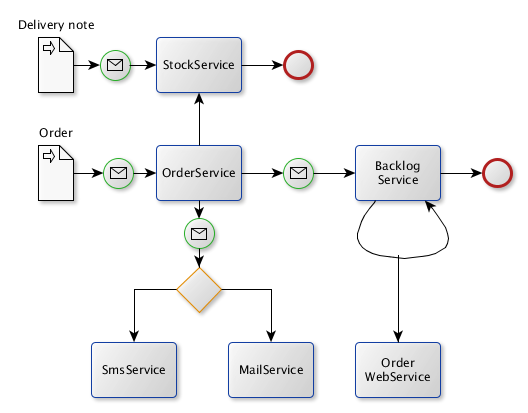

Enterprise Integration Patterns with Apache Camel and Spring Integration.
==========

The domain used to demonstrate EIPs with the frameworks is a Bicycle Store.

The bike shop imports CSV delivery notes and orders.

##Import of delivery notes
Each delivery note record is converted into a StockItem and sent to the eip.common.services.StockService.addStockItem(StockItem) method.
This method increases the number of items on stock for the matching the item number.
A delivery note is simple flat CSV file:
	
	FRAME; Road bike frame 60 cm;1935182366;103.95;2
	DRIVE; Shimano HG LX;1935182439;31.85;6
 
### Spring Integration
Spring Integration does not support CSV files so we use Spring Batch for this.
The delivery note records are read one at a time, converted into a StockItem to be sent to the StockService.

### Camel
Camel provides the CSV component. Together with the Split component a record at a time is converted to a StockItem (eip.camel.CsvToStockItemProcessor) and sent to the StockService.

## Import of orders
An order consists of a header(record type 'ORDER') and and items(record type 'ITEM')  

	ORDER;Bike support;1
	ITEM;FRAME;Road bike frame 60 cm;1935182366
	ITEM;DRIVE;Shimano HG LX;1935182439

All order items until next order block begins are read and mapped to an Order object.
The Order object is sent to the eip.common.services.OrderService.handleOrder(Order) method. 
The availability is queried from eip.common.services.StockService.getStockItem(String).
If available the number on stock is decreased, if not the method eip.common.services.BacklogService.orderBacklogItems(Backlog) is called
to add an entry in the database table BACKLOGITEM.

### Spring Integration
Again, Spring Batch does the heavy lifting. As the records has to be aggregated - read an ORDER, read all ITEM's until another ORDER or end of file 
the FlatFileItemReader is wrapped in eip.spring.integration.OrderFlatFileItemReaderDelegate.

### Camel
The Split component splits on the token "ORDER", and feeds the ORDER and its ITEM's to eip.camel.CsvToOrderProcessor.

## Further decoupling the system
### Loosly coupling of the Stock- and OrderService
Consider you have different applications responsible for Stock and Order. 
This can be done by proxying the interface of the StockService over the messaging system.
The client is totally unaware of the underlying implementation.

#### Spring Integration
The Gateway proxies the StockService interface, invoking the methods over channels.
A ServiceActivator listens on the request channel, forwards the request to a bean and returns the reply to the reply channel.

#### Camel
The Proxy component defines the route from the StockService interface to a Direct component.
A route is defined to route from the Direct component to a Spring bean.

## ActiveMQ, Enricher and Routing
As an order is processed, a notification should be sent to the customer.
This should be done asynchronous but reliable. JMS implemented by ActiveMQ is used for this purpose.

Further, the notification producer should not be aware of if the customer is to notified using SMS or mail.
An enricher converts the Notification message into either a SmsNotification or a MailNotification based on
customer configuration.

The enriched message is passed to a router, dispatching to a JMS queue for SMS or mail.